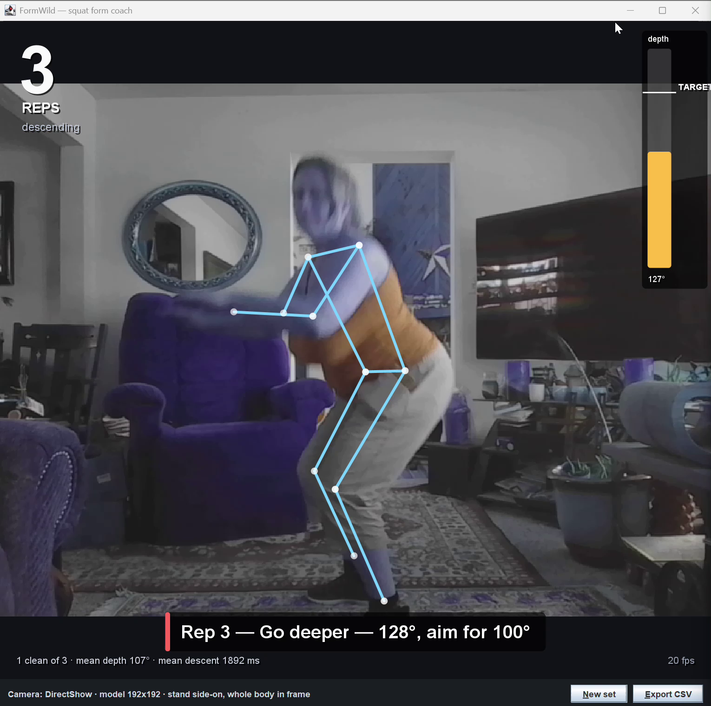
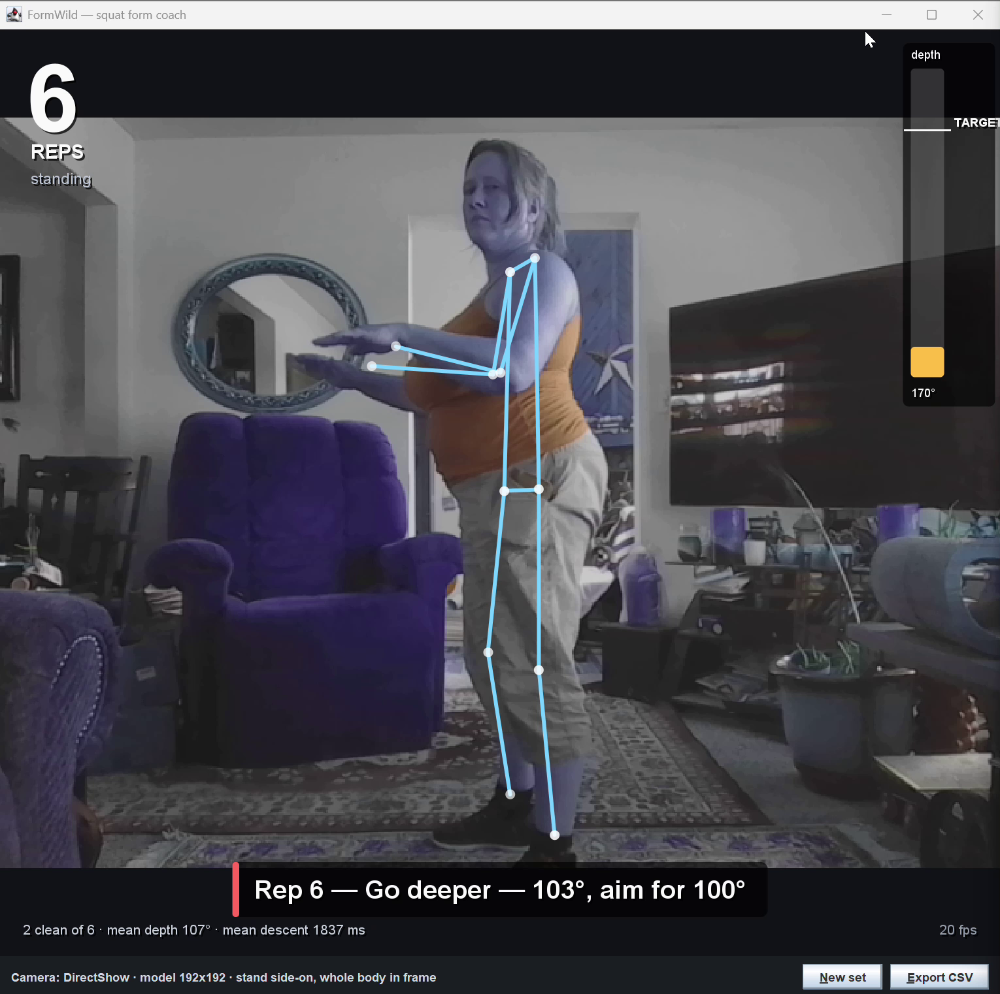

# FormWild — a personal trainer in your webcam

**A squat form coach built on Java 26.** It watches you through the webcam you already
own, tracks 17 body keypoints in real time, counts your reps, and names the specific
fault on the rep it happened: *"Go deeper — 112°, aim for 100°"*, *"Chest up — you're
61° forward"*, *"Slow the descent."*

> Built for the [Hackster.io **Modern Java in the Wild**](https://www.hackster.io/contests/modern-java-in-the-wild)
> contest — Best Health Solution.

**Everything runs locally. No account. No cloud. No API key. $0 to run.**

---

## The problem

A personal trainer costs $80 an hour and still isn't watching when you do your fifth set
alone in the garage. Form is exactly the thing you cannot see about yourself — depth
feels deeper than it is, and fatigue quietly turns a controlled descent into a drop.
Most fitness apps answer this with a camera feed to someone's cloud, which is a hard sell
for video of you exercising in your living room.

FormWild runs the entire pipeline — capture, pose estimation, rep detection, coaching —
on your own machine, and tells you the one thing worth hearing about each rep as it
happens.

## Privacy is the design, not a setting

- Pose inference runs **locally** in-process (ONNX Runtime on the CPU). No frame is ever
  written to disk and nothing is uploaded anywhere.
- The model is downloaded once, from a public repository, with no account.
- Session history is a **CSV file on your own disk** — openable in any spreadsheet,
  deletable with one keypress, yours.
- The repository's `.gitignore` refuses `*.png` outright, so a captured frame cannot
  even be committed here by accident.

For a camera pointed at someone's home, this is the whole point.

## What it looks like

The coach window shows the live camera with a skeleton overlay, a rep counter big enough
to read from across the room, a depth gauge tracking the current rep against the target
line while it is still happening, a worded cue banner for the last rep, and a running
session summary.





These are real frames from a real session: the counter, the depth gauge tracking the
rep against the target line, and the cue naming the angle it measured. In live testing
the counter matched every set (14/14, 5/5, 8/8 across three sessions), and the reps
that got the "go deeper" cue were exactly the ones that were shallow.

The pipeline can also prove itself without a GUI — because a window cannot be verified
over SSH, on a build server, or by a judge skimming a terminal:

```console
$ run.cmd --diagnose 5
camera backend: DirectShow
model input: 192x192
running the pipeline for 5 seconds...

inference rate     : 20.2 fps
mean inference time: 7 ms
frames captured    : 101
frames dropped     : 0  (0% - dropped deliberately to keep latency flat)
```

That is an unedited run. Mean pose inference is **7 ms on a plain laptop CPU** — the
camera, not the model, is the bottleneck. Frame rate follows the camera's exposure time,
so it drops in dim light (one more reason the calibration guide says to turn the lights
on).

## Architecture

```
  Webcam ──► CaptureLoop (virtual thread) ──► ArrayBlockingQueue<Frame>(1), drop-oldest
                                                      │
                                                      ▼
                                     pipeline (virtual thread)
                                     PoseEstimator (ONNX, letterboxed, FFM model load)
                                                      │
                                                      ▼
                                     Pose — 17 Keypoints (records, confidence-gated)
                                                      │
                                     AngleSmoother — median over a 5-sample window
                                     (Gatherers.windowSliding on the batch path)
                                                      │
                                                      ▼
                                     SquatAnalyzer — hysteresis state machine
                                     └► Rep (record) + sealed FormFault ► worded cue
                                                      │
                                        immutable RenderState, published atomically
                                                      ▼
                        Swing window: overlay + counter + depth gauge + cue banner
                                        └► SessionLog — CSV on local disk
```

**Backpressure is the whole capture design.** The camera produces ~30 frames a second;
inference and analysis consume what they can. An unbounded queue would grow without
limit and the overlay would drift further behind the lifter with every rep — the app
would look broken precisely when someone is filming it. Instead the queue holds exactly
**one frame and drops the older one**: latency stays flat and inference always works on
the most recent reality, at the cost of frames nobody would have seen anyway. Dropped
frames are counted and reported, not ignored, so the FPS readout is honest.

The two sides of the UI never share mutable state: the pipeline thread publishes a
complete immutable `RenderState` and the event-dispatch thread paints whatever snapshot
is current. No locks, and no way to paint a half-updated frame.

## Modern Java 26 in this project

Every feature below is here because it was the right tool. Each links to the file that
uses it.

| Java 26 feature | Where | Why it earns its place |
|---|---|---|
| **Virtual threads** | [`capture/CaptureLoop.java`](src/main/java/dev/formwild/capture/CaptureLoop.java), [`ui/CoachWindow.java`](src/main/java/dev/formwild/ui/CoachWindow.java) | Capture and the inference pipeline each get a thread whose lifecycle is trivial to reason about, with no pool to size for a two-thread problem. |
| **Stream Gatherers** (`windowSliding`) | [`analysis/AngleSmoother.java`](src/main/java/dev/formwild/analysis/AngleSmoother.java) | Median-smoothing a signal is literally a sliding window, so the batch path is one stream operation instead of a hand-rolled index loop. |
| **FFM API** (`Arena`, `MemorySegment`) | [`pose/PoseEstimator.java`](src/main/java/dev/formwild/pose/PoseEstimator.java) | The 9 MB model file is memory-mapped in a confined `Arena`: the OS pages it in lazily and the mapping is released deterministically when the arena closes, instead of a heap copy lingering until the next GC. |
| **Sealed interface + exhaustive `switch` with record patterns** | [`model/FormFault.java`](src/main/java/dev/formwild/model/FormFault.java) | Every fault the coach can name is a record in a sealed hierarchy, and the cue switch has **no `default`** — adding a fault is a compile error until the coach knows how to call it out. |
| **Unnamed patterns** (`case ShallowDepth _ ->`) | [`model/FormFault.java`](src/main/java/dev/formwild/model/FormFault.java) | Matching on shape where the payload is irrelevant, without inventing unused names. |
| **Records throughout** | [`model/`](src/main/java/dev/formwild/model), [`ui/RenderState.java`](src/main/java/dev/formwild/ui/RenderState.java) | The whole domain is immutable data — which is also what makes the lock-free UI handoff safe. |
| **Text blocks** | [`Main.java`](src/main/java/dev/formwild/Main.java), [`capture/CaptureLoop.java`](src/main/java/dev/formwild/capture/CaptureLoop.java) | Multi-line reports and error messages that read like what they print. |

**No preview flags.** Everything FormWild uses is final in Java 26, so there is no
`--enable-preview` anywhere — the pom's `<release>26</release>` and the committed
[`build.log`](build.log) are the contest's Java 26 verification. The one flag the run
scripts do pass is `--enable-native-access=ALL-UNNAMED`, because JDK 26 restricts
`System::load` (OpenCV's native loader) and says the unflagged path *"will be blocked in
a future release"* — passed now rather than discovered later.

## What it coaches — and what it refuses to guess at

Each completed rep is judged and, if something was wrong, called out with the
measurement, worst fault first:

| Fault | Rule | Cue |
|---|---|---|
| **Shallow depth** | minimum knee angle stayed above 100° (parallel ≈ 90°, with a little grace) | "Go deeper — 112°, aim for 100°" |
| **Torso lean** | shoulder→hip line more than 55° off vertical at any point on the way down | "Chest up — you're 61° forward" |
| **Rushed descent** | reached the bottom in under 800 ms — but **only on a rep that actually travelled** (below 130°). A shallow dip is already called shallow; calling it rushed as well is noise. | "Slow the descent" |

### Why there is no knee-valgus fault

Most form-checker ideas fail on the same geometry, and this project would rather admit it
than pretend. Knee angle — and therefore depth and tempo — is only measurable from a
**side-on** camera. Knees caving inward is only measurable from a **front-on** one,
because the inward travel happens along exactly the axis a side view projects away. One
2D camera cannot supply both.

This wasn't theoretical: an early test fixture produced a knee-valgus detection firing at
full confidence on a skeleton with perfectly straight legs. The detection wasn't buggy —
the question was unanswerable from that viewpoint, and the code answered it anyway.

So v1 commits to the side-on view and measures **three things properly — depth, tempo,
torso angle — instead of five things badly**. Left/right asymmetry is absent for the same
reason: in profile, the far leg is occluded by the near one.

## How a rep is detected

Raw keypoints jitter by several degrees even when the body is still, so the knee angle is
**median-smoothed** over a 5-sample window first. Median, not mean, deliberately: a mean
drags a single mistracked frame into its neighbours and shifts the detected rep boundary
in time, and rep detection is fundamentally about *when* the angle reversed. A median
discards the outlier and leaves the turning point where it was.

The smoothed angle drives a state machine with **hysteresis**:

```
  STANDING ──(angle < 150°)──► DESCENDING ──(angle rises again)──► ASCENDING
     ▲                                                                 │
     └───────────────(angle > 165°, rep counted, beep)─────────────────┘
```

The two thresholds are deliberately 15° apart. With a single boundary, a lifter pausing
near it produces a burst of phantom reps as noise pushes the angle back and forth across
the line — a test drives 100 frames of exactly that oscillation and asserts the count
stays at zero. Requiring travel from below 150° to above 165° means a rep needs real
movement, not jitter.

Confidence gating runs through everything: a keypoint below 0.30 confidence is treated as
*absent*, never as a position. Angles involving it return empty rather than a sentinel
(a knee angle of 0 would silently become a "very deep squat" downstream), the overlay
never draws a bone from a guessed joint, and joint dot opacity carries confidence so a
marginal detection *looks* marginal.

### Model gotchas the code documents

- MoveNet emits `(y, x, score)` — **y first**. Swapping them renders the skeleton rotated
  90°, the classic bug in this pipeline.
- Preprocessing **letterboxes rather than stretches** to the model's square input. A
  stretched 4:3 frame has wrong joint angles — a 90° knee bend can read as 100° — which
  for an app that judges angles is not a cosmetic issue.
- The input tensor is built in whatever dtype the model file actually declares
  (this export wants INT32), read from the session at load time rather than assumed from
  a tutorial.

## Build and run

**Requires JDK 26.** Verify with `java -version` first. Windows is the tested platform;
the OpenCV and ONNX Runtime dependencies ship native binaries for Windows, Linux and
macOS via Maven, so nothing is installed by hand.

```console
git clone https://github.com/darcy0408/formwild.git
cd formwild
scripts\fetch-model.ps1      # one-time, ~9 MB, no account (see below)
mvn clean package
run.cmd                      # opens the coach window
```

Without `run.cmd`:

```console
java --enable-native-access=ALL-UNNAMED -jar target\formwild.jar
```

The model is [MoveNet SinglePose Lightning](https://huggingface.co/Xenova/movenet-singlepose-lightning)
(~9 MB). The weights are not committed — they are large, and they are not ours to
redistribute. On Linux/macOS, download the file the script names into
`models/movenet-lightning.onnx` with `curl -L`.

### Modes

| Command | Does |
|---|---|
| `run.cmd` | the coach window (default) |
| `run.cmd --diagnose [seconds]` | run the full pipeline headless and report throughput |
| `run.cmd --version` | runtime, Java version |

### Calibration — 30 seconds that decide whether it works

Pose estimation is only as good as what the camera can see:

1. **Stand side-on** to the camera. Depth, tempo and torso angle are all profile
   measurements — this is the one non-negotiable.
2. **About 2 m back**, whole body in frame, head to ankles. The cue banner tells you when
   it can't see enough of you ("Step back — I need your whole body in frame").
3. **Light the room.** The camera slows its shutter in dim light, which costs frame rate
   and tracking quality. A dark garage at night needs the overhead light on.
4. Clothing that contrasts with the background helps; a black outfit against a black
   sofa does not.

In the window: **Alt+N** starts a new set, **Alt+E** exports the session, and each
completed rep beeps — feedback that works mid-rep, when you are not looking at the screen.

## Testing

```console
$ mvn test
Tests run: 24, Failures: 0, Errors: 0, Skipped: 0
```

**The whole suite runs with the webcam unplugged.** The analyser tests drive synthesised
side-on skeletons built arithmetically, so each test states exactly what body position it
describes — and the fixture is itself under test: one test asserts the synthetic skeleton
really produces the knee angle it claims before any other test is allowed to trust it.

Coverage includes: a clean deep squat counts as exactly one rep; ten reps count as ten,
not nine or eleven; hovering at the threshold manufactures no phantom reps; a shallow rep
is flagged with the angle actually reached and a deep one is not; a forward fold is
caught and an upright trunk is not; a dropped rep is called rushed, a 2-second descent is
not, and a shallow dip is *not* also called rushed; unreliable keypoints produce no
reading rather than a wrong one; faults come out worst-first; the smoother kills
single-frame spikes **without shifting the true minimum in time** (and a test shows the
median beating a mean on exactly that, which is why it is used); and the session CSV
keeps a stable column count with the header written exactly once.

## Accessibility

- **Colour never carries meaning alone.** Every cue is words plus a coloured edge; the
  depth gauge's target line is labelled "TARGET" in text and the live angle is printed in
  degrees; the machine state is spelled out ("descending"), not implied by a hue.
- **Audio channel:** a beep on each completed rep — the display works without sound, and
  the sound works without the display.
- HUD text is drawn with a dark halo so it stays legible over any camera image, and the
  rep counter is 96 pt — readable even after a 1080p recording is scaled down.
- Buttons have keyboard mnemonics and accessible descriptions, not just labels.

## Bill of materials

| Item | Cost |
|---|---|
| A laptop with a webcam you already own | $0 |
| JDK 26 ([Adoptium Temurin](https://adoptium.net)) | free |
| MoveNet SinglePose Lightning (~9 MB) | free, no account |
| Accounts / API keys / cloud services | **none** |
| **Total** | **$0** |

Bring-your-own-device: the built-in webcam is the sensor. A phone camera works too, via
Windows Phone Link or any phone-as-webcam app, which puts the camera at squat-rack height
more easily than a laptop does.

## Limitations, honestly

- **Side-on, one person, squats.** The analyser is scoped to what a single 2D profile
  view can actually measure — see the knee-valgus section above for what that excludes
  and why. More exercises fit the same state machine, but v1 does one movement properly.
- **Thresholds are informed coaching judgement, not clinical guidance.** Parallel-ish
  depth at 100°, 800 ms minimum descent, 55° torso lean: defensible defaults, but this is
  a training aid, not medical or physiotherapy advice.
- **Frame rate follows the light.** The camera lengthens exposure in dim rooms and
  throughput drops with it. `--diagnose` reports what your setup actually achieves.
- **The pose model is a general-purpose single-person model.** Unusual viewpoints,
  heavy occlusion (a barbell across the frame), or two people in shot degrade it. The
  confidence gate means degradation shows up as "no reading" rather than wrong coaching —
  but it still means no coaching.

## Project layout

```
src/main/java/dev/formwild/
├── Main.java              entry point: --coach, --diagnose, --version
├── capture/               CaptureLoop (virtual thread, drop-oldest queue), Frame
├── pose/                  PoseEstimator: FFM model load, letterbox, ONNX inference
├── analysis/              AngleSmoother (median, Gatherers), SquatAnalyzer (state machine)
├── model/                 Joint, Keypoint, Pose, Rep, sealed FormFault
├── session/               SessionLog — CSV append, local disk
└── ui/                    CoachWindow, CoachPanel (overlay + HUD), RenderState
src/test/                  24 tests, no webcam required
scripts/fetch-model.ps1    one-time model download
SPIKE-RESULTS.md           the go/no-go spike that de-risked camera + model up front
build.log                  committed proof of a green Java 26 build
```
